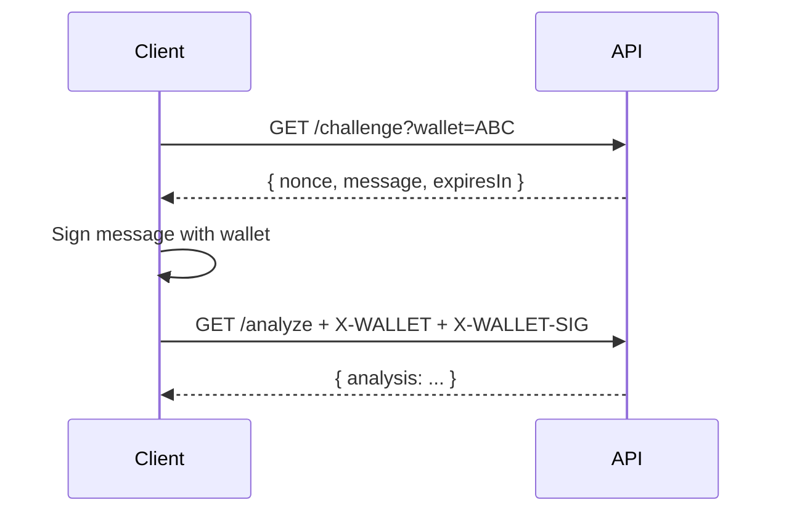

# 🔌 Oracle API Documentation

Integrate Consult Oracle into your project using the x402 protocol or $BASEDBOT token-gating.

## Base URL

```
https://raid.based-bot.fun/api/oracle/v1/analyze
```

## Authentication

The Oracle API is fully decentralized with two authentication methods:

| Method | Header | Description |
| :--- | :--- | :--- |
| **x402 Payment** | `X-PAYMENT` | Pay-per-use with USDC (trustless) |
| **Token Gate** | `X-WALLET` | Free for $BASEDBOT holders |

### x402 Payment (Recommended for Integrations)

For pay-per-use access, send a signed USDC transaction via the x402 protocol:
- **Basic Analysis:** 0.05 USDC
- **PRO Report:** 0.10 USDC

The x402 flow:
1. Make a request without payment → receive `402 Payment Required` with payment details
2. Sign a USDC transfer transaction (do NOT broadcast)
3. Encode the signed TX in the `X-PAYMENT` header
4. Retry the request → receive analysis result

### Token Gate (Free for Holders) - Signature Required

$BASEDBOT holders get free access based on their tier. **Wallet ownership must be proven via signature.**

| Tier | Requirement | Access |
| :--- | :--- | :--- |
| 🐋 **Whale** | 10M+ $BASEDBOT | Free PRO + 100 req/min |
| 🦍 **Based Ape** | 1M+ $BASEDBOT | Free PRO + 10 req/min |
| 💎 **Diamond Hands** | 500K+ $BASEDBOT | Basic + 5 req/min |
| 🌱 **Seedling** | 100K+ $BASEDBOT | Basic + 5 req/min |
| 🎰 **Degen** | Any amount | Basic + 5 req/min |

#### Challenge-Response Flow

To prevent abuse, you must prove wallet ownership:



**Step 1: Request Challenge**
```bash
curl "https://raid.based-bot.fun/api/oracle/v1/challenge?wallet=YOUR_WALLET"
```

Response:
```json
{
  "nonce": "abc123...",
  "message": "Oracle API Access\nNonce: abc123...\nWallet: YOUR_WALLET",
  "expiresIn": 300
}
```

**Step 2: Sign the Message**
Sign the `message` field with your Solana wallet (ed25519 signature).

**Step 3: Send Signed Request**
```bash
curl "https://raid.based-bot.fun/api/oracle/v1/analyze?ca=TOKEN_ADDRESS" \
  -H "X-WALLET: YOUR_WALLET" \
  -H "X-WALLET-SIG: BASE64_ENCODED_SIGNATURE"
```

## Endpoints

### GET `/api/oracle/v1/challenge`

Generate a challenge nonce for wallet signature verification.

| Parameter | Type | Required | Description |
| :--- | :--- | :--- | :--- |
| `wallet` | string | Yes | Wallet address to verify |

### GET `/api/oracle/v1/analyze`

Analyze a Solana token contract address.

#### Query Parameters

| Parameter | Type | Required | Description |
| :--- | :--- | :--- | :--- |
| `ca` | string | Yes | Token contract address |
| `pro` | boolean | No | Request PRO analysis (requires payment or tier) |

#### Headers

| Header | Required | Description |
| :--- | :--- | :--- |
| `X-WALLET` | No | User wallet for tier check |
| `X-WALLET-SIG` | If X-WALLET | Base64-encoded signature of challenge message |
| `X-PAYMENT` | No | Base64-encoded x402 payment payload |

---

## Response Schemas

### Basic Analysis Response (0.05 USDC or any $BASEDBOT)

```json
{
  "success": true,
  "tier": "Pay-per-use",
  "analysis": {
    "score": 85,
    "verdict": "Looking pretty based, ser.",
    "safety": {
      "mintAuthorityDisabled": true,
      "freezeAuthorityDisabled": true,
      "topHoldersSafe": true,
      "topHoldersPercent": 15.2
    },
    "tokenInfo": {
      "name": "Example Token",
      "symbol": "EX",
      "supply": "1000000000",
      "decimals": 6
    },
    "holderCount": 5420
  }
}
```

### PRO Report Response (0.10 USDC or 1M+ $BASEDBOT)

PRO includes everything in Basic, plus deep analytics:

```json
{
  "success": true,
  "tier": "Based Ape",
  "proAccess": true,
  "analysis": {
    "score": 85,
    "verdict": "The oracle sees strength in this one...",
    "safety": { ... },
    "tokenInfo": { ... },
    "holderCount": 5420,
    "scoreBreakdown": {
      "base": 50,
      "mintAuthority": 25,
      "freezeAuthority": 15,
      "concentration": -5,
      "holderHealth": 5,
      "holderTrend": 3,
      "whaleRisk": 0,
      "rugCheckBonus": 10,
      "tokenAgePenalty": 0,
      "liquidityPenalty": 0,
      "bundlePenalty": -10,
      "devHoldingPenalty": -3,
      "total": 90
    },
    "holderStats": {
      "topHolders": [
        { "address": "ABC...", "percent": 5.2, "isLP": true },
        { "address": "DEF...", "percent": 3.1 }
      ],
      "whaleCount": 3,
      "lpCount": 2,
      "concentration": 18.5,
      "concentrationExcludingLP": 12.3,
      "priceUsd": "0.0042",
      "marketCap": "4200000",
      "volume24h": "150000",
      "priceChange24h": 12.5,
      "developerHolding": {
        "address": "GHI...",
        "percent": 2.1,
        "found": true
      },
      "bundleAnalysis": {
        "isBundled": true,
        "bundleSize": 5,
        "holdingPercent": 8.3,
        "funderAddress": "JKL..."
      },
      "whaleActivity": {
        "status": "Accumulating",
        "netChange": 2.5,
        "txCount": 12
      },
      "rugCheck": {
        "score": 85,
        "rating": "Good",
        "risks": []
      },
      "holderDeltas": {
        "h24": 120,
        "d7": 450
      }
    }
  }
}
```

---

## Pricing Summary

| Tier | Cost | Access Level |
| :--- | :--- | :--- |
| **Basic Analysis** | 0.05 USDC | Score, verdict, safety checks |
| **PRO Report** | 0.10 USDC | + Whale tracking, bundles, dev holdings, holder trends |
| **Token Gate (Ape/Whale)** | FREE | Full PRO access |

---

## 402 Payment Required Response

If payment is needed, you'll receive:

```json
{
  "error": "Payment required",
  "paymentRequired": {
    "amount": "50000",
    "asset": "EPjFWdd5AufqSSqeM2qN1xzybapC8G4wEGGkZwyTDt1v",
    "payTo": "6GVSrRoEcLkMLHddEq59PGQdWLBPg3jXMECZCfMz7QBB",
    "description": "Oracle Analysis API"
  }
}
```

## Error Codes

| Code | Description |
| :--- | :--- |
| 400 | Invalid contract address |
| 402 | Payment required |
| 429 | Rate limit exceeded |
| 500 | Internal server error |

## CORS

The API supports CORS for browser-based integrations. Preflight (`OPTIONS`) requests are handled automatically.

---


**Integration Support**
Need help integrating? Join our community on [Twitter/X](https://x.com/basedbotsol).

