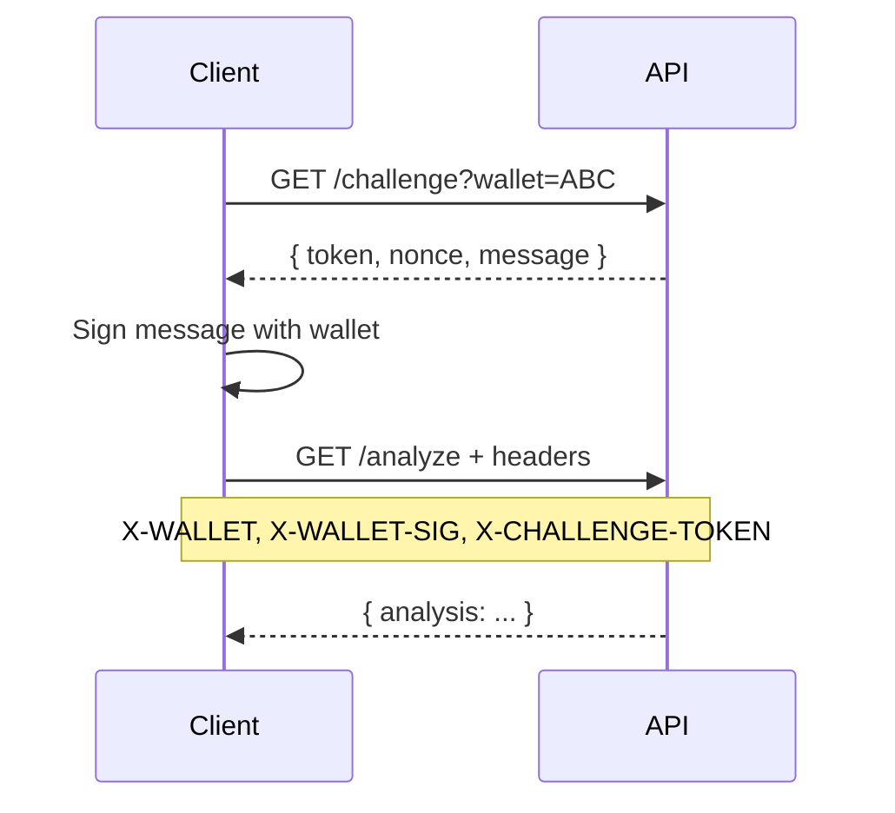

# 🔌 Oracle API Documentation

Integrate Consult Oracle into your project using the x402 protocol or $BASEDBOT token-gating.

## Base URL

```
https://raid.based-bot.fun/api/oracle/v1/analyze
```

## Authentication Methods

The Oracle API supports two authentication methods. **x402 Payment takes priority** - if a payment is provided, wallet signature is not required.

| Method | Headers Required | Description |
| :--- | :--- | :--- |
| **x402 Payment** | `X-PAYMENT` | Pay-per-use with USDC (recommended for integrations) |
| **Token Gate** | `X-WALLET` + `X-WALLET-SIG` + `X-CHALLENGE-TOKEN` | Free for $BASEDBOT holders |

---

## Method 1: x402 Payment (Recommended)

For pay-per-use access, no wallet signature is needed. Just pay with USDC.

### Pricing
- **Basic Analysis:** 0.05 USDC
- **PRO Report:** 0.10 USDC

### The x402 Flow
1. Make a request without payment → receive `402 Payment Required`
2. Sign a USDC transfer transaction (do NOT broadcast)
3. Encode the signed TX in the `X-PAYMENT` header
4. Retry the request → receive analysis result

```bash
# Step 1: Get payment requirements
curl "https://raid.based-bot.fun/api/oracle/v1/analyze?ca=TOKEN_ADDRESS"
# Returns 402 with payment details

# Step 2: After signing USDC transfer
curl "https://raid.based-bot.fun/api/oracle/v1/analyze?ca=TOKEN_ADDRESS" \
  -H "X-PAYMENT: BASE64_ENCODED_PAYMENT"
```

---

## Method 2: Token Gate (Free for Holders)

$BASEDBOT holders get free access based on their tier. **Wallet ownership must be proven via challenge-response signature.**

### Tier Requirements

| Tier | Requirement | Access |
| :--- | :--- | :--- |
| 🐋 **Whale** | 10M+ $BASEDBOT | Free PRO + 100 req/min |
| 🦍 **Based Ape** | 1M+ $BASEDBOT | Free PRO + 10 req/min |
| 💎 **Diamond Hands** | 500K+ $BASEDBOT | Basic + 5 req/min |
| 🌱 **Seedling** | 100K+ $BASEDBOT | Basic + 5 req/min |
| 🎰 **Degen** | Any amount | Basic + 5 req/min |

### Challenge-Response Flow

To prevent wallet spoofing, you must prove ownership via signature:



### Step 1: Request Challenge
```bash
curl "https://raid.based-bot.fun/api/oracle/v1/challenge?wallet=YOUR_WALLET"
```

Response:
```json
{
  "success": true,
  "token": "eyABCDEF...",
  "nonce": "abc123...",
  "message": "Oracle API Access\nNonce: abc123...\nWallet: YOUR_WALLET",
  "expiresIn": 300
}
```

### Step 2: Sign the Message
Sign the `message` field with your Solana wallet (ed25519 signature), then base64 encode.

### Step 3: Send Signed Request
```bash
curl "https://raid.based-bot.fun/api/oracle/v1/analyze?ca=TOKEN_ADDRESS" \
  -H "X-WALLET: YOUR_WALLET" \
  -H "X-WALLET-SIG: BASE64_ENCODED_SIGNATURE" \
  -H "X-CHALLENGE-TOKEN: eyABCDEF..."
```

---

## Endpoints

### GET `/api/oracle/v1/challenge`

Generate a challenge for wallet signature verification. Returns a stateless token valid for 5 minutes.

| Parameter | Type | Required | Description |
| :--- | :--- | :--- | :--- |
| `wallet` | string | Yes | Wallet address to verify |

### GET `/api/oracle/v1/analyze`

Analyze a Solana token contract address.

#### Query Parameters

| Parameter | Type | Required | Description |
| :--- | :--- | :--- | :--- |
| `ca` | string | Yes | Token contract address |
| `pro` | boolean | No | Request PRO analysis |

#### Headers

| Header | Required | Description |
| :--- | :--- | :--- |
| `X-WALLET` | For token-gate | User wallet address |
| `X-WALLET-SIG` | If X-WALLET | Base64 signature of challenge message |
| `X-CHALLENGE-TOKEN` | If X-WALLET | Token received from challenge endpoint |
| `X-PAYMENT` | For x402 | Signed USDC payment (bypasses signature requirement) |

---

## Response Schemas

### Basic Analysis Response

```json
{
  "success": true,
  "tier": "Pay-per-use",
  "analysis": {
    "score": 85,
    "verdict": "Looking pretty based, ser.",
    "safety": {
      "mintAuthorityDisabled": true,
      "freezeAuthorityDisabled": true,
      "topHoldersSafe": true,
      "topHoldersPercent": 15.2
    },
    "tokenInfo": {
      "name": "Example Token",
      "symbol": "EX",
      "supply": "1000000000",
      "decimals": 6
    },
    "holderCount": 5420
  }
}
```

### PRO Report Response

PRO includes everything in Basic, plus:
- Score breakdown with all bonuses/penalties
- Top holders with addresses
- Whale activity tracking
- Bundle/snipe detection
- Developer holdings
- RugCheck audit data
- Holder trend deltas

---

## Error Codes

| Code | Error | Description |
| :--- | :--- | :--- |
| 400 | Invalid address | Contract address format is invalid |
| 401 | Signature required | Missing wallet signature for token-gate |
| 401 | Invalid token | Challenge token expired or invalid |
| 402 | Payment required | Need x402 payment or token holdings |
| 429 | Rate limit exceeded | Wait for rate limit reset |
| 500 | Internal error | Server-side issue |

## CORS

The API supports CORS for browser-based integrations. Preflight (`OPTIONS`) requests are handled automatically.

---


**Integration Support**
Need help integrating? Find us on [Twitter/X](https://x.com/basedbotsol).

